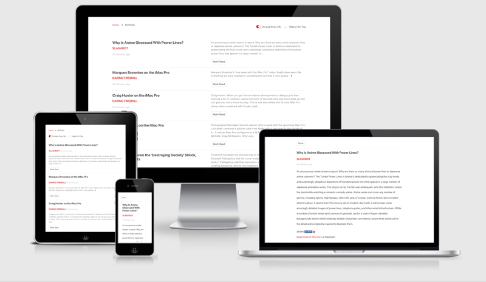
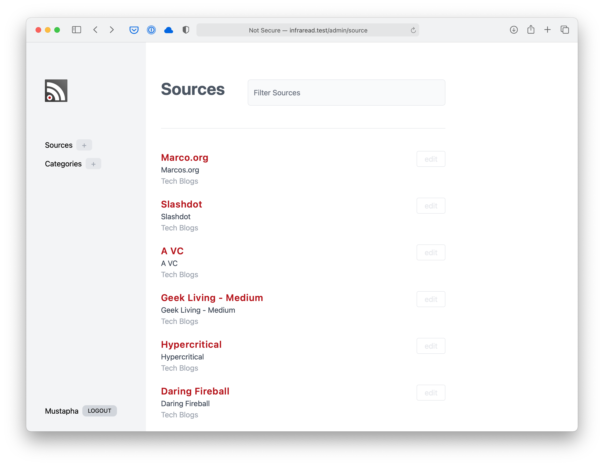
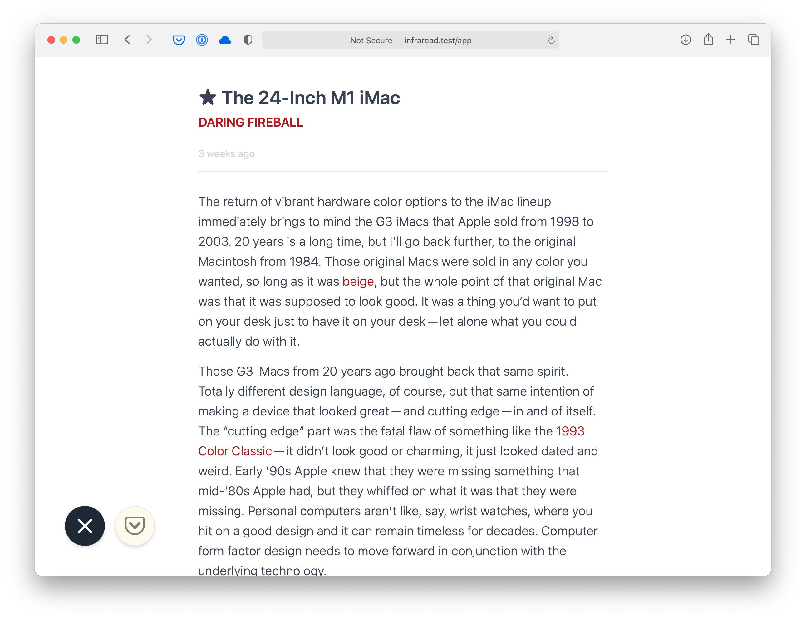

# InfraRead

InfraRead (pronounced _infrared_ ) is an elegant self-hosted RSS feed reader and sync service. It is optimized for simplicity, reading and comfort. It is inspired by [Unread](https://itunes.apple.com/us/app/unread-rss-reader/id1252376153?mt=8) and built with [Laravel](https://laravel.com) and [VueJs](https://vuejs.org/).

 <br/>
 <br/>
 <br/>

## Features:

*   Distraction free. Attention to details and optimized for reading
*   Access From any device and feeds stay synced
*   Import your own OPML or add feeds manually
*   100% responsive
*   Full Keyboard Navigation using Vim Shortcuts (Key bindings can be changed)
*   Save For later, can choose between Instapaper and Pocket
*   Offline persistence of settings and previously loaded posts

## Requirements

*  [Same Requirements as Laravel 8](https://laravel.com/docs/5.5/installation#server-requirements)
*  Ability to create Cron Jobs

## Installation

*  Download or clone the repository to your server 
*  run ```composer install```
*  run ```php artisan key:generate```
*  make a copy of ```.env.example``` and save as ```.env```
*  fill your admin details in ```.env```
*  fill your database details in ```.env```
*  run ```php artisan migrate``` to migrate the database
*  run ```php artisan db:seed```, this will populate your admin details in the database
*  add this line to your Crontab: ```* * * * * php /path/to/your/site/artisan schedule:run >> /dev/null 2>&1```
*  If you want to modify the js and css assets, also run: ```npm install```, and then ```npm run dev```

## API (Phase 1)

The application now exposes a versioned read-only JSON API plus an on‑demand summary endpoint under `/api/v1` (all routes require authentication via Sanctum personal access tokens):

Endpoints (GET unless noted):

* `/api/v1/posts` – Paginated list of posts (default page size 20)
	* Filters (use JSON:API style bracket params):
		* `filter[read]=0|1`
		* `filter[source]={source_id}`
		* `filter[category]={category_id}`
	* Includes: `include=source,category` (comma separated)
	* Sorting: `sort=-posted_at` (default newest first) or `sort=posted_at`
	* Pagination: `page` (page number, starting at 1) and `page.size` (1–200)
* `/api/v1/posts/{id}` – Single post, supports `include=source,category`
* `/api/v1/posts/{id}/summary` (POST) – Generate a short HTML summary (see below)
* `/api/v1/sources` – List sources, optional `include=category`
* `/api/v1/sources/{id}` – Single source (future expansion)
* `/api/v1/categories` – List categories
* `/api/v1/categories/{id}` – Single category (future expansion)

Response Shape (examples):

Posts list returns:
```
{
	"data": [ { post fields ... } ],
	"meta": { "total": n, "current_page": 1, "last_page": n, "per_page": 20 }
}
```

Summary endpoint returns:
```
{
	"data": {
		"post_id": 123,
		"sentences": 2,
		"summary": "<p>Sentence one.</p><p>Sentence two.</p>"
	}
}
```

Errors use standard HTTP status codes (401 unauthenticated, 404, 422 validation, 502 upstream summary failure).

## Authentication (Sanctum Personal Access Tokens)

All `/api/v1/*` routes are protected by `auth:sanctum`. For manual usage you create a personal access token and send it as a Bearer token.

Create (Tinker):
```
php artisan tinker
>>> use App\Models\User;
>>> $user = User::first(); // or create a dedicated API user
>>> $token = $user->createToken('dev')->plainTextToken;
>>> $token
"1|XXXXXXXXXXXXXXXXXXXXXXXXXXXXXXXXXXXXXXXXXXXX"
```
Copy the full string (including the leading numeric id before the pipe). It is only shown once.

Request example (curl):
```
curl -H "Accept: application/json" -H "Authorization: Bearer 1|XXXX..." http://infraread.test/api/v1/posts
```

Revoke a token by deleting it from `personal_access_tokens` (e.g. `$user->tokens()->where('name','dev')->delete();`).

## On‑Demand Summaries

Route: `POST /api/v1/posts/{id}/summary`

Body (JSON, optional):
```
{ "sentences": 2 }
```
If `sentences` omitted a sensible default is used. A per-minute rate limit is enforced (configured via the `summaries` rate limiter in `RouteServiceProvider` / `RateLimiter::for('summaries', ...)`). Failures from the upstream summarizer respond with `502` and `{ "error": "..." }`.

## Temporary API Tester UI

Path: `/api-tester` (behind normal web auth session). Paste a personal access token into the Auth Token box; subsequent in-page fetches add the `Authorization: Bearer` header. This page is purely a development aid and should be removed or protected further for production deployments.

## Roadmap / Next Ideas

* Phase 2: Mutations (mark read/unread, mark batch, save for later).
* Token management UI (issue / revoke without Tinker).
* Service layer refactor for summaries (decouple from `Post` model).
* Pagination / filtering metadata alignment with JSON:API (links, first/last URLs).
* Additional includes (e.g. media, category on source detail).

---

_These API + auth notes document the August 2025 milestone adding Phase 1 read-only endpoints, Sanctum integration, and summaries._

## License

M.I.T. do anything you want with the code as long as you provide attribution back and you and don’t hold me liable

## Contact or Questions

Find me on [Twitter](https://twitter.com/beirutspring)

## Built on top of

[Laravel](laravel.com), [VueJs](vuejs.org), [Tailwind Css](https://tailwindcss.com), [Will Vincent Feeds](https://github.com/willvincent/feeds) which 
builds on top of [SimplePie](http://simplepie.org/)