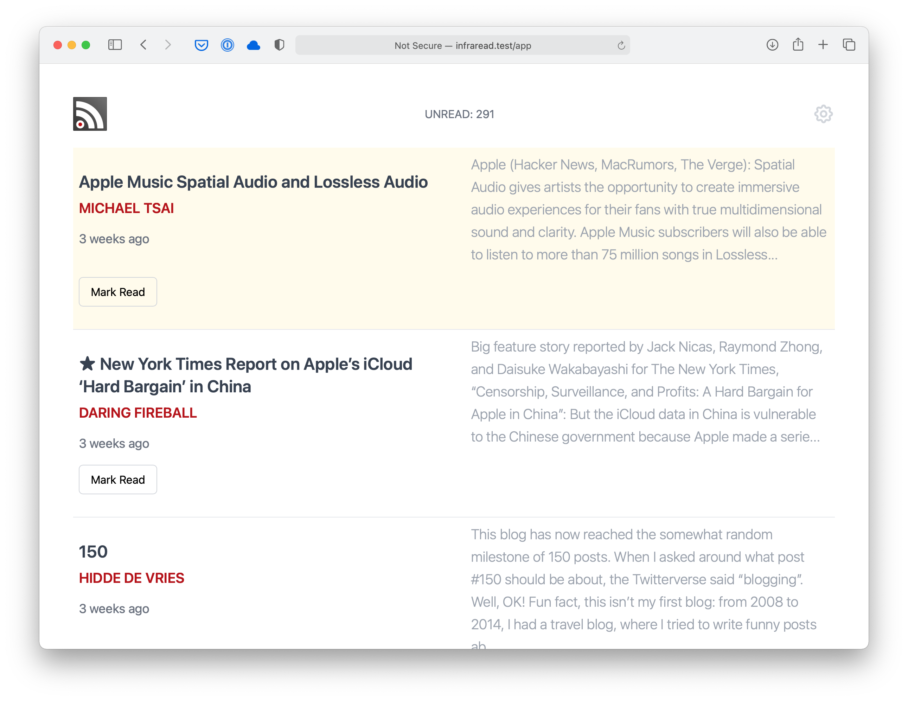

# InfraRead

InfraRead (pronounced _infrared_ ) is an elegant self-hosted RSS feed reader and sync service. It is optimized for simplicity, reading and comfort. It is inspired by [Unread](https://itunes.apple.com/us/app/unread-rss-reader/id1252376153?mt=8) and built with [Laravel](https://laravel.com) and [VueJs](https://vuejs.org/).

 <br/>
 <br/>
 <br/>

## Features:

*   Distraction free. Attention to details and optimized for reading
*   Access From any device and feeds stay synced
*   Import your own OPML or add feeds manually
*   100% responsive
*   Full Keyboard Navigation using Vim Shortcuts (Key bindings can be changed)
*   Save For later, can choose between Instapaper and Pocket
*   Offline persistence of settings and previously loaded posts
*   **Complete REST API** for programmatic access and external client development

## API Documentation

InfraRead provides a comprehensive REST API for all functionality. See **[API-REFERENCE.md](API-REFERENCE.md)** for complete documentation including:

- Authentication with personal access tokens
- Posts management (read/unread, bulk operations, filtering)
- Sources and categories CRUD
- OPML import/export for RSS reader migration
- Rate limiting and error handling
- Complete examples and workflows

## Requirements

*  [Same Requirements as Laravel 8](https://laravel.com/docs/5.5/installation#server-requirements)
*  Ability to create Cron Jobs
*  Queue worker for background jobs (database queue driver recommended). In production (Ubuntu), run a persistent systemd service; in macOS development, run `php artisan queue:work` in a terminal.

## Installation

*  Download or clone the repository to your server 
*  run ```composer install```
*  run ```php artisan key:generate```
*  make a copy of ```.env.example``` and save as ```.env```
*  fill your admin details in ```.env```
*  fill your database details in ```.env```
*  run ```php artisan migrate``` to migrate the database
*  run ```php artisan db:seed```, this will populate your admin details in the database
*  add this line to your Crontab: ```* * * * * php /path/to/your/site/artisan schedule:run >> /dev/null 2>&1```
*  If you want to modify the js and css assets, also run: ```npm install```, and then ```npm run dev```

On macOS (development) without cron, you can run the scheduler loop instead:

```
php artisan schedule:work
```

## Queue worker (systemd service)

InfraRead uses Laravel's queue for background jobs (e.g., on‑demand feed refresh, summaries). With the database queue driver you don't need Redis/Horizon—just a long‑running worker.

1) Create a systemd service (adjust paths, user, and env):

File: `/etc/systemd/system/infraread-queue-worker.service`

```
[Unit]
Description=Infraread Laravel Queue Worker
After=network.target

[Service]
User=www-data
Group=www-data
WorkingDirectory=/var/www/infraread/current
Environment=APP_ENV=production
Environment=QUEUE_CONNECTION=database
ExecStart=/usr/bin/php artisan queue:work --sleep=3 --tries=3 --timeout=120 --max-time=3600
Restart=always
RestartSec=5
StandardOutput=journal
StandardError=journal

[Install]
WantedBy=multi-user.target
```

2) Enable and start the service:

```
sudo systemctl daemon-reload
sudo systemctl enable --now infraread-queue-worker
sudo systemctl status infraread-queue-worker
```

Notes
- Ensure queue tables exist: `php artisan queue:table && php artisan migrate` (run once).
- Tune `--timeout`, `--tries`, and `--sleep` based on workload.
- Tail logs: `journalctl -u infraread-queue-worker -f`.
- macOS/dev: you can simply run `php artisan queue:work` in a terminal; systemd isn’t available on macOS.

### macOS (Herd) development

For local development using Laravel Herd on macOS:

1) Ensure `.env` contains `QUEUE_CONNECTION=database` and migrate the queue tables once:

```
php artisan queue:table
php artisan migrate
```

2) Run the queue worker in a terminal tab:

```
php artisan queue:work --sleep=3 --tries=3 --timeout=120
```

3) Run the scheduler loop in another tab (instead of setting up cron locally):

```
php artisan schedule:work
```

Herd provides PHP and web serving on macOS; you don’t need systemd. Keep these two processes running while developing.

### Environment variables (.env) for queues

Minimal queue-related settings:

```
# Common
QUEUE_CONNECTION=database

# Optional: increase if your feed fetch/summarization can take longer
# These are passed as CLI flags to queue:work; shown here for reference
# WORKER_SLEEP=3
# WORKER_TRIES=3
# WORKER_TIMEOUT=120
```

Recommended worker flags
- Ubuntu (systemd ExecStart): `queue:work --sleep=3 --tries=3 --timeout=120`
- macOS dev (terminal): `queue:work --sleep=3 --tries=3 --timeout=120`

Tune `--timeout` based on the slowest expected job (e.g., long feeds); avoid setting it too high to keep stuck jobs from blocking the worker.

## Feed Processing & Management

InfraRead processes RSS feeds through a combination of scheduled batch processing (cron) and on-demand jobs. The system includes comprehensive error handling, health monitoring, and exponential backoff for failed feeds.

### Manual Feed Updates

Update all active feeds:
```bash
php artisan app:update_posts
```

Update a specific feed:
```bash
php artisan app:update_posts {source_id}
```

The command provides real-time progress reporting with:
- 🔄 Processing indicators for each feed
- ✓ Success confirmations with post counts
- ✗ Error notifications with details
- ⏳ Backoff notifications for temporarily disabled feeds
- 📊 Comprehensive summary with statistics

### Feed Health Monitoring

InfraRead tracks detailed metrics for each feed source:

**Health Status:**
- `active` - Feed processing normally
- `failing` - Recent failures, but still being attempted
- `failed` - Multiple consecutive failures, in exponential backoff

**Exponential Backoff:**
When feeds fail repeatedly, the system automatically implements exponential backoff:
- 1st failure: retry in 2 minutes
- 2nd failure: retry in 4 minutes  
- 3rd failure: retry in 8 minutes
- Up to 24 hours maximum delay

**Metrics Tracked:**
- `last_fetched_at` - When the feed was last successfully processed
- `last_fetch_duration_ms` - Processing time in milliseconds
- `consecutive_failures` - Number of failures since last success
- `last_error_at` - When the most recent error occurred
- `last_error_message` - Details of the most recent error

### Checking Feed Status

View detailed processing information:
```bash
# Check application logs
tail -f storage/logs/laravel.log

# Check for feed processing entries
grep "Feed processing" storage/logs/laravel.log

# Check for errors
grep "ERROR" storage/logs/laravel.log | grep -i feed
```

**Log Entries Include:**
- Feed processing summaries with statistics
- Individual source success/failure details
- Error context for debugging (HTTP status, XML parsing issues, etc.)
- Performance metrics and processing duration

### Troubleshooting Feed Issues

**Common Issues and Solutions:**

1. **HTTP Errors (404, 500, etc.)**
   - Check feed URL is still valid
   - Verify the website is accessible
   - Look for redirects or URL changes

2. **XML Parsing Errors**
   - Feed may have malformed XML
   - Check for encoding issues
   - Verify RSS/Atom format compliance

3. **Timeout Issues**
   - Feed server may be slow
   - Increase timeout in configuration if needed
   - Monitor network connectivity

4. **Plugin Errors**
   - Check plugin configuration
   - Review plugin-specific error messages
   - Verify plugin dependencies

**Manual Recovery:**
```bash
# Reset a failed source (via tinker)
php artisan tinker
>>> $source = App\Models\Source::find(123);
>>> $source->update(['status' => 'active', 'consecutive_failures' => 0]);
>>> $source->updatePosts();  // Try processing immediately
```

### Performance Monitoring

**Database Indexes:**
The system includes optimized database indexes for:
- Posts filtering by read status, source, and category
- Source health and metrics queries
- Date-based post filtering

**Processing Statistics:**
Each command run provides detailed statistics:
- Total sources processed
- Success/failure counts
- Sources skipped due to backoff
- Total posts processed
- Processing duration

**Monitoring in Production:**
- Set up log monitoring for "Feed processing completed" entries
- Monitor consecutive failure counts
- Watch for sources stuck in "failed" status
- Track processing duration trends

## Plugin System

InfraRead features a comprehensive plugin system for post-processing RSS content. Plugins can modify posts after they're fetched but before they're displayed, enabling content transformation, link fixing, automatic tagging, and more.

### Available Plugins

**FixRelativeLinks** - Converts relative links and images to absolute URLs
- **Purpose**: Fixes broken images and links in RSS feeds that use relative paths
- **Options**: 
  - `convert_images` (bool): Convert relative image URLs (default: true)
  - `convert_links` (bool): Convert relative link URLs (default: true)  
  - `remove_srcset` (bool): Remove srcset attributes (default: true)

**MakeTextLegible** - Improves text readability and formatting
- **Purpose**: Breaks up long paragraphs, removes ads, and cleans formatting
- **Options**:
  - `min_letters_count` (int): Minimum paragraph length to split (default: 700)
  - `max_paragraph_length` (int): Maximum allowed paragraph length (default: 1000)
  - `remove_ads` (bool): Remove advertisement content (default: true)
  - `clean_formatting` (bool): Clean excessive formatting (default: true)

**MarkPostAsRead** - Auto-marks posts as read based on patterns
- **Purpose**: Automatically marks certain posts as read based on title/source patterns
- **Options**:
  - `blacklist` (array): Array of url/string patterns to match for auto-reading

**ReplaceArticleLink** - Replaces article URLs with embedded links
- **Purpose**: For curated feeds, replaces the feed URL with the first external link found
- **Options**:
  - `exclusions` (array): Strings to exclude from link replacement
  - `selector` (string): CSS selector for finding links (default: "article a")

### Plugin Configuration

Plugins are configured in `app/Plugins/Kernel.php` with source-specific settings:

```php
'plugins' => [
    'kottke.org' => [
        'FixRelativeLinks' => [
            'convert_images' => true,
            'convert_links' => true,
            'remove_srcset' => true
        ],
        'MakeTextLegible' => [
            'max_paragraph_length' => 800
        ]
    ]
]
```

### Plugin Management Commands

**List Available Plugins:**
```bash
php artisan plugins:manage list
```

**Validate Plugin Configuration:**
```bash
php artisan plugins:manage validate
```

**Test Plugin on Specific Source:**
```bash
php artisan plugins:manage test --source=123
```

**View Sources with Plugin Configuration:**
```bash
php artisan plugins:manage sources
```

### Creating Custom Plugins

1. **Create Plugin Class** in `app/Plugins/` implementing `PluginInterface`:

```php
<?php
namespace App\Plugins;
use App\Models\Post;

class MyCustomPlugin implements PluginInterface
{
    private $post;
    private $options;

    public function __construct(Post $post, array $options = [])
    {
        $this->post = $post;
        $this->options = $options;
    }

    public function handle(): bool
    {
        try {
            // Your plugin logic here
            $this->post->save();
            return true;
        } catch (\Exception $e) {
            return false;
        }
    }

    public function getMetadata(): array
    {
        return [
            'name' => 'My Custom Plugin',
            'description' => 'What this plugin does',
            'version' => '1.0.0',
            'author' => 'Your Name',
            'modifies' => ['field1', 'field2'],
            'options' => [
                'option1' => 'Description of option1'
            ]
        ];
    }
}
```

2. **Add to Kernel Configuration** in `app/Plugins/Kernel.php`
3. **Test with Management Commands**

### Plugin Error Handling

- Plugins log failures with context preservation
- Failed plugins don't prevent other plugins from running
- Comprehensive error tracking in `storage/logs/laravel.log`
- Plugin execution statistics and timing available

## API (Phases 1-3 Complete)

The application now exposes a comprehensive versioned JSON API under `/api/v1` with full CRUD operations for posts, sources, and categories. All routes require authentication via Sanctum personal access tokens.

**Read Endpoints (Phase 1):**

* `/api/v1/posts` – Paginated list of posts (default page size 20)
	* Filters (use JSON:API style bracket params):
		* `filter[read]=0|1`
		* `filter[source]={source_id}`
		* `filter[category]={category_id}`
	* Includes: `include=source,category` (comma separated)
	* Sorting: `sort=-posted_at` (default newest first) or `sort=posted_at`
	* Pagination: `page` (page number, starting at 1) and `page.size` (1–200)
* `/api/v1/posts/{id}` – Single post, supports `include=source,category`
* `/api/v1/posts/{id}/summary` (POST) – Generate a short HTML summary
* `/api/v1/sources` – List sources, optional `include=category`
* `/api/v1/sources/{id}` – Single source
* `/api/v1/categories` – List categories
* `/api/v1/categories/{id}` – Single category

**Mutation Endpoints (Phase 2):**

* `PATCH /api/v1/posts/{id}/read-status` – Mark single post read/unread
* `PATCH /api/v1/posts/bulk-read-status` – Mark multiple posts read/unread (up to 1000)
* `PATCH /api/v1/posts/mark-all-read` – Mark all posts read/unread with optional filtering

**Management Endpoints (Phase 3):**

* `POST /api/v1/sources` – Create new RSS feed source
* `PUT /api/v1/sources/{id}` – Update existing source
* `DELETE /api/v1/sources/{id}` – Remove source and all posts
* `POST /api/v1/sources/{id}/refresh` – Force refresh posts from source
* `GET /api/v1/categories` – List categories with source counts
* `POST /api/v1/categories` – Create new category
* `PUT /api/v1/categories/{id}` – Update category
* `DELETE /api/v1/categories/{id}` – Remove category
* `GET /api/v1/export-opml` – Export all sources as OPML
* `POST /api/v1/preview-opml` – Preview OPML file before import
* `POST /api/v1/import-opml` – Import sources from OPML file

See **[API-REFERENCE.md](API-REFERENCE.md)** for complete documentation with examples, request/response formats, and error handling.

Response Shape (examples):

Posts list returns:
```
{
	"data": [ { post fields ... } ],
	"meta": { "total": n, "current_page": 1, "last_page": n, "per_page": 20 }
}
```

Summary endpoint returns:
```
{
	"data": {
		"post_id": 123,
		"sentences": 2,
		"summary": "<p>Sentence one.</p><p>Sentence two.</p>"
	}
}
```

Errors use standard HTTP status codes (401 unauthenticated, 404, 422 validation, 502 upstream summary failure).

## Authentication (Sanctum Personal Access Tokens)

All `/api/v1/*` routes are protected by `auth:sanctum`. For manual usage you create a personal access token and send it as a Bearer token.

Create (Tinker):
```
php artisan tinker
>>> use App\Models\User;
>>> $user = User::first(); // or create a dedicated API user
>>> $token = $user->createToken('dev')->plainTextToken;
>>> $token
"1|XXXXXXXXXXXXXXXXXXXXXXXXXXXXXXXXXXXXXXXXXXXX"
```
Copy the full string (including the leading numeric id before the pipe). It is only shown once.

Request example (curl):
```
curl -H "Accept: application/json" -H "Authorization: Bearer 1|XXXX..." http://infraread.test/api/v1/posts
```

Revoke a token by deleting it from `personal_access_tokens` (e.g. `$user->tokens()->where('name','dev')->delete();`).

## On‑Demand Summaries

Route: `POST /api/v1/posts/{id}/summary`

Body (JSON, optional):
```
{ "sentences": 2 }
```
If `sentences` omitted a sensible default is used. A per-minute rate limit is enforced (configured via the `summaries` rate limiter in `RouteServiceProvider` / `RateLimiter::for('summaries', ...)`). Failures from the upstream summarizer respond with `502` and `{ "error": "..." }`.

## Temporary API Tester UI

Path: `/api-tester` (behind normal web auth session). Paste a personal access token into the Auth Token box; subsequent in-page fetches add the `Authorization: Bearer` header. This page is purely a development aid and should be removed or protected further for production deployments.

## Roadmap / Next Ideas

* ✅ Phase 1: Read-only API endpoints with authentication and summaries
* ✅ Phase 2: Post mutation endpoints (mark read/unread, bulk operations)
* ✅ Phase 3: Source/category management and OPML import/export
* 🚧 Phase 6: Enhanced background processing and performance monitoring (foundation complete)
* Future: Vue SPA extraction to separate repository
* Future: External read-it-later service integrations
* Future: Advanced observability and metrics endpoints

## Recent Updates (August 2025)

**Phase 6 Foundation Complete:**
- Enhanced feed processing with comprehensive error handling
- Source health monitoring with exponential backoff for failed feeds  
- Structured exception handling with detailed context preservation
- Performance tracking and metrics collection
- Improved console commands with progress reporting
- Database optimization with strategic indexes
- **Plugin system overhaul with structured configuration and comprehensive testing**
- Comprehensive test coverage (132 tests passing)

**API Maturity:**
- Complete CRUD operations for all entities
- Robust error handling and validation
- Rate limiting and security measures
- Full OPML import/export functionality
- Comprehensive documentation and examples

---

_These notes document the comprehensive API implementation through Phase 3 (August 2025) including read endpoints, mutations, source/category management, OPML import/export, and Phase 6 foundation work with enhanced feed processing, error handling, and performance monitoring._

## License

M.I.T. do anything you want with the code as long as you provide attribution back and you and don’t hold me liable

## Contact or Questions

Find me on [Twitter](https://twitter.com/beirutspring)

## Built on top of

[Laravel](laravel.com), [VueJs](vuejs.org), [Tailwind Css](https://tailwindcss.com), [Will Vincent Feeds](https://github.com/willvincent/feeds) which 
builds on top of [SimplePie](http://simplepie.org/)
